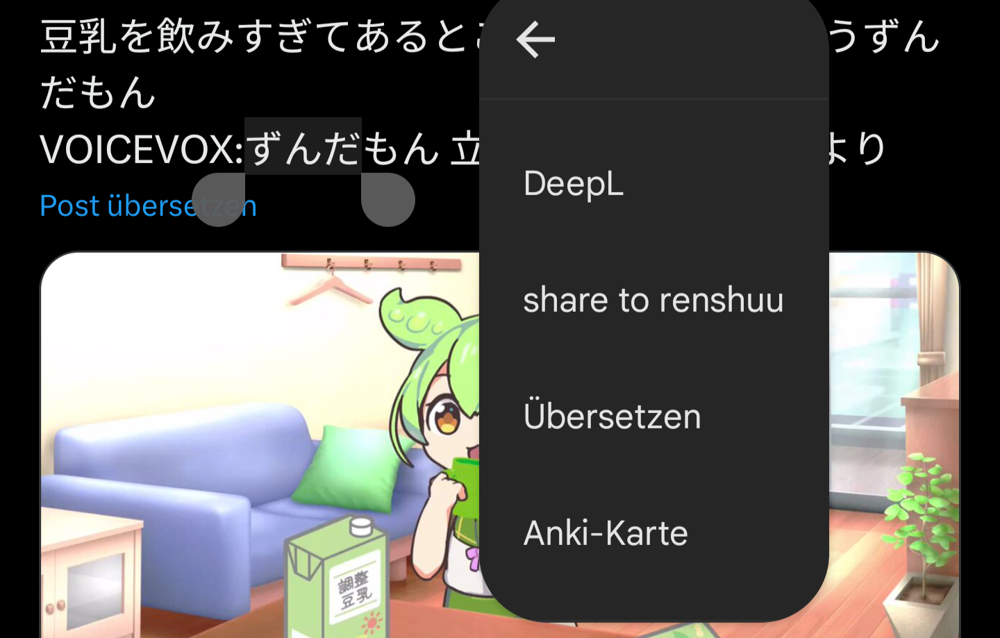

# What is this?

This is a tiny Android app that will add an "share to renshuu" entry to the selected text context menu.
That way you can conveniently search look up words from anywhere in the renshuu app.

Example:

